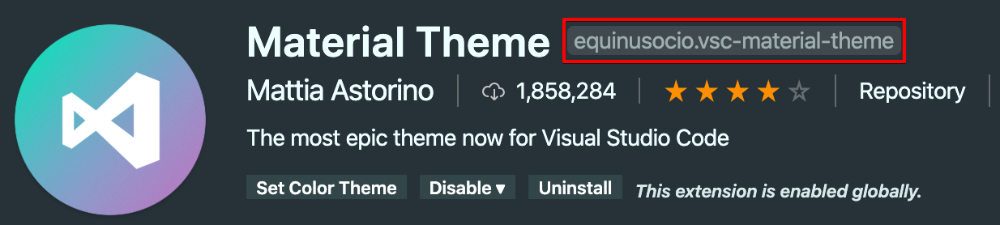

# Typescript & React で Single File Components

経年劣化に耐える React のソフトウェア設計を考えるためのサンプルプロジェクト。参考資料で示した Qiita の記事を大いに参考にしました。

## 目次

<!-- TOC -->

- [Typescript & React で Single File Components](#typescript--react-%e3%81%a7-single-file-components)
  - [目次](#%e7%9b%ae%e6%ac%a1)
  - [デモ](#%e3%83%87%e3%83%a2)
      - [トップページ - スクロール](#%e3%83%88%e3%83%83%e3%83%97%e3%83%9a%e3%83%bc%e3%82%b8---%e3%82%b9%e3%82%af%e3%83%ad%e3%83%bc%e3%83%ab)
      - [レスポンシブ UI（Mobile 用と Desktop 用）](#%e3%83%ac%e3%82%b9%e3%83%9d%e3%83%b3%e3%82%b7%e3%83%96-uimobile-%e7%94%a8%e3%81%a8-desktop-%e7%94%a8)
  - [詳細](#%e8%a9%b3%e7%b4%b0)
    - [TypeScript & React のプロジェクトを作成](#typescript--react-%e3%81%ae%e3%83%97%e3%83%ad%e3%82%b8%e3%82%a7%e3%82%af%e3%83%88%e3%82%92%e4%bd%9c%e6%88%90)
    - [絶対パスで React コンポーネントをインポートできるようにする](#%e7%b5%b6%e5%af%be%e3%83%91%e3%82%b9%e3%81%a7-react-%e3%82%b3%e3%83%b3%e3%83%9d%e3%83%bc%e3%83%8d%e3%83%b3%e3%83%88%e3%82%92%e3%82%a4%e3%83%b3%e3%83%9d%e3%83%bc%e3%83%88%e3%81%a7%e3%81%8d%e3%82%8b%e3%82%88%e3%81%86%e3%81%ab%e3%81%99%e3%82%8b)
    - [ESLint & Prettier の導入](#eslint--prettier-%e3%81%ae%e5%b0%8e%e5%85%a5)
      - [eslint-config-airbnb](#eslint-config-airbnb)
      - [eslint-plugin-react](#eslint-plugin-react)
      - [eslint-plugin-react-hooks](#eslint-plugin-react-hooks)
      - [eslint-plugin-import](#eslint-plugin-import)
      - [eslint-plugin-jsx-a11y](#eslint-plugin-jsx-a11y)
      - [eslint-plugin-jest](#eslint-plugin-jest)
      - [eslint-plugin-prefer-arrow](#eslint-plugin-prefer-arrow)
      - [@typescript-eslint](#typescript-eslint)
      - [@typescript-eslint/parser](#typescript-eslintparser)
      - [@typescript-eslint/eslint-plugin](#typescript-eslinteslint-plugin)
      - [eslint-plugin-prettier](#eslint-plugin-prettier)
    - [Stylelint の導入（オプション）](#stylelint-%e3%81%ae%e5%b0%8e%e5%85%a5%e3%82%aa%e3%83%97%e3%82%b7%e3%83%a7%e3%83%b3)
      - [Styled-components](#styled-components)
      - [stylelint-config-prettier](#stylelint-config-prettier)
    - [husky & lint-staged の導入](#husky--lint-staged-%e3%81%ae%e5%b0%8e%e5%85%a5)
      - [lint-staged](#lint-staged)
      - [hasky](#hasky)
    - [Redux の導入](#redux-%e3%81%ae%e5%b0%8e%e5%85%a5)
      - [複数の reducer を結合する](#%e8%a4%87%e6%95%b0%e3%81%ae-reducer-%e3%82%92%e7%b5%90%e5%90%88%e3%81%99%e3%82%8b)
    - [React Router の導入](#react-router-%e3%81%ae%e5%b0%8e%e5%85%a5)
      - [画面遷移時のスクロール位置の初期化](#%e7%94%bb%e9%9d%a2%e9%81%b7%e7%a7%bb%e6%99%82%e3%81%ae%e3%82%b9%e3%82%af%e3%83%ad%e3%83%bc%e3%83%ab%e4%bd%8d%e7%bd%ae%e3%81%ae%e5%88%9d%e6%9c%9f%e5%8c%96)
      - [React Router と Redux の統合](#react-router-%e3%81%a8-redux-%e3%81%ae%e7%b5%b1%e5%90%88)
    - [Styled-components の導入](#styled-components-%e3%81%ae%e5%b0%8e%e5%85%a5)
      - [Global CSS を指定する方法](#global-css-%e3%82%92%e6%8c%87%e5%ae%9a%e3%81%99%e3%82%8b%e6%96%b9%e6%b3%95)
    - [Material-UI の導入](#material-ui-%e3%81%ae%e5%b0%8e%e5%85%a5)
      - [Styled-components で定義したスタイルを優先する](#styled-components-%e3%81%a7%e5%ae%9a%e7%be%a9%e3%81%97%e3%81%9f%e3%82%b9%e3%82%bf%e3%82%a4%e3%83%ab%e3%82%92%e5%84%aa%e5%85%88%e3%81%99%e3%82%8b)
      - [テーマカラーを設定する](#%e3%83%86%e3%83%bc%e3%83%9e%e3%82%ab%e3%83%a9%e3%83%bc%e3%82%92%e8%a8%ad%e5%ae%9a%e3%81%99%e3%82%8b)
      - [上部に固定されたヘッダーを作成](#%e4%b8%8a%e9%83%a8%e3%81%ab%e5%9b%ba%e5%ae%9a%e3%81%95%e3%82%8c%e3%81%9f%e3%83%98%e3%83%83%e3%83%80%e3%83%bc%e3%82%92%e4%bd%9c%e6%88%90)
      - [Grid React component のスクリーンサイズに応じた調節](#grid-react-component-%e3%81%ae%e3%82%b9%e3%82%af%e3%83%aa%e3%83%bc%e3%83%b3%e3%82%b5%e3%82%a4%e3%82%ba%e3%81%ab%e5%bf%9c%e3%81%98%e3%81%9f%e8%aa%bf%e7%af%80)
      - [画面サイズに合わせて、React コンポーネントを表示・非表示をコントロール](#%e7%94%bb%e9%9d%a2%e3%82%b5%e3%82%a4%e3%82%ba%e3%81%ab%e5%90%88%e3%82%8f%e3%81%9b%e3%81%a6react-%e3%82%b3%e3%83%b3%e3%83%9d%e3%83%bc%e3%83%8d%e3%83%b3%e3%83%88%e3%82%92%e8%a1%a8%e7%a4%ba%e3%83%bb%e9%9d%9e%e8%a1%a8%e7%a4%ba%e3%82%92%e3%82%b3%e3%83%b3%e3%83%88%e3%83%ad%e3%83%bc%e3%83%ab)
      - [画面トップへスクロールして戻るボタン](#%e7%94%bb%e9%9d%a2%e3%83%88%e3%83%83%e3%83%97%e3%81%b8%e3%82%b9%e3%82%af%e3%83%ad%e3%83%bc%e3%83%ab%e3%81%97%e3%81%a6%e6%88%bb%e3%82%8b%e3%83%9c%e3%82%bf%e3%83%b3)
    - [React Helmet の導入](#react-helmet-%e3%81%ae%e5%b0%8e%e5%85%a5)
      - [ヘッダー情報を追加する](#%e3%83%98%e3%83%83%e3%83%80%e3%83%bc%e6%83%85%e5%a0%b1%e3%82%92%e8%bf%bd%e5%8a%a0%e3%81%99%e3%82%8b)
    - [Storybook for React(Create React App 用)](#storybook-for-reactcreate-react-app-%e7%94%a8)
    - [Docker 上で開発環境をセットアップする](#docker-%e4%b8%8a%e3%81%a7%e9%96%8b%e7%99%ba%e7%92%b0%e5%a2%83%e3%82%92%e3%82%bb%e3%83%83%e3%83%88%e3%82%a2%e3%83%83%e3%83%97%e3%81%99%e3%82%8b)
  - [VSCode の設定について](#vscode-%e3%81%ae%e8%a8%ad%e5%ae%9a%e3%81%ab%e3%81%a4%e3%81%84%e3%81%a6)
    - [拡張機能の管理](#%e6%8b%a1%e5%bc%b5%e6%a9%9f%e8%83%bd%e3%81%ae%e7%ae%a1%e7%90%86)
    - [VSCode の設定の管理](#vscode-%e3%81%ae%e8%a8%ad%e5%ae%9a%e3%81%ae%e7%ae%a1%e7%90%86)
  - [既存の React プロジェクトのアップデート](#%e6%97%a2%e5%ad%98%e3%81%ae-react-%e3%83%97%e3%83%ad%e3%82%b8%e3%82%a7%e3%82%af%e3%83%88%e3%81%ae%e3%82%a2%e3%83%83%e3%83%97%e3%83%87%e3%83%bc%e3%83%88)
    - [Create React App](#create-react-app)
    - [React などの他のパッケージのアップグレード](#react-%e3%81%aa%e3%81%a9%e3%81%ae%e4%bb%96%e3%81%ae%e3%83%91%e3%83%83%e3%82%b1%e3%83%bc%e3%82%b8%e3%81%ae%e3%82%a2%e3%83%83%e3%83%97%e3%82%b0%e3%83%ac%e3%83%bc%e3%83%89)
  - [参考資料](#%e5%8f%82%e8%80%83%e8%b3%87%e6%96%99)
  - [公式ドキュメント](#%e5%85%ac%e5%bc%8f%e3%83%89%e3%82%ad%e3%83%a5%e3%83%a1%e3%83%b3%e3%83%88)

<!-- /TOC -->

## デモ

#### トップページ - スクロール

- ランディングページによくある、リンクをクリックすると自動スクロールされる仕組み。
- トップページの先頭に戻るボタンを表示（スクロールをトリガーにする）。


#### レスポンシブ UI（Mobile 用と Desktop 用）

- Desktop 用の画面では、ナビゲーションをページ上部に表示させる。
- Mobile 用の画面では、ナビゲーションをページ下部に表示させる（指で押しやすいため）。


## 詳細

### TypeScript & React のプロジェクトを作成

```bash
npx create-react-app react-typescript-sfc --template typescript
```

Adding TypeScript  
<https://create-react-app.dev/docs/adding-typescript/>

### 絶対パスで React コンポーネントをインポートできるようにする

相対パスだと、リファクタリングによってコンポーネントの配置を変更した場合に、インポート先もすべて変更する必要が出てくる。絶対パスを指定することにより、上記の問題を回避する。

設定方法としては、`tsconfig.json` に以下の設定を追加するだけ。

```json
{
  "compilerOptions": {
    "baseUrl": "src"
  },
  "include": ["src"]
}
```

例えば、`components/Button` を以下のように絶対パスを使ってインポートできるようになる。

```tsx
import Button from 'components/Button';
```

<!-- VSCode を使っている場合、絶対パスを使用すると `Cannot find module` と怒られるはずなので、VSCode の `settings.json` に以下の設定を追加する。

```json
{
  "typescript.preferences.importModuleSpecifier": "non-relative"
}
``` -->

おそらく、絶対パスにすると補完が効かなくなるので、さらに、`path-intellisense` を拡張機能として追加する。

**参考資料**  
[Create React App - Absolute Imports](https://create-react-app.dev/docs/importing-a-component/#absolute-imports)  
[VS Code: “Cannot find module” from root path](https://stackoverflow.com/questions/55063550/vs-code-cannot-find-module-from-root-path)

### ESLint & Prettier の導入

まず、コーディングスタイルを統一するために、ESLint と Prettier の導入を行う。

```bash
yarn add -D \
eslint @types/eslint \
prettier @types/prettier \
@typescript-eslint/eslint-plugin \
@typescript-eslint/parser \
eslint-config-airbnb \
eslint-config-prettier \
eslint-plugin-import \
eslint-plugin-react \
eslint-plugin-react-hooks
eslint-plugin-jsx-a11y \
eslint-plugin-jest \
eslint-plugin-prefer-arrow \
eslint-plugin-prettier \
@types/eslint-plugin-prettier
```

以下の各種設定を 設定ファイル `.eslitrc.js` に記述する。デフォルトの `.eslitrc` の JSON ファイルの場合、キーにいちいちダブルクオーテーションをつけないといけないので、`JSファイル` にしたほうが書きやすいと思う。

#### eslint-config-airbnb

AirBnb が提供する ESLint の有名な共通設定を導入する。
`eslint-config-airbnb` を導入する際、以下のパッケージが必要になる。

- eslint
- eslint-plugin-import
- eslint-plugin-react
- eslint-plugin-react-hooks
- eslint-plugin-jsx-a11y
- @typescript-eslint/parser

eslint-config-airbnb の導入  
<https://github.com/airbnb/javascript/tree/master/packages/eslint-config-airbnb#eslint-config-airbnb-1>

#### eslint-plugin-react

`eslint-plugin-react` は React 固有の Linting の設定を追加するためのプラグイン。使用するために、`extends` と `plugins` に設定を追加する。

```js
extends: [
  'eslint:recommended',
  'plugin:react/recommended',
],

plugins: [
  'react'
],
```

また、React のバージョンを自動的に特定するために、`detect` の設定を行う（将来的に、`detect` がデフォルトになる予定なので、いずれ設定する必要がなくなる）。

```js
settings: {
  react: {
    version: 'detect',
  },
}
```

さらに、JSX のサポート（ESLint 2+）を追加するために、

```js
parserOptions: {
  ecmaFeatures: {
    jsx: true,
  },
},
```

eslint-plugin-react の設定  
<https://github.com/yannickcr/eslint-plugin-react#configuration>

#### eslint-plugin-react-hooks

`eslint-plugin-react-hooks`は、React Hook に対する linting を設定するためのプラグイン。マニュアル設定を適応する場合、以下のように設定する。

```js
plugins: [
  "react-hooks"
],

rules: {
  'react-hooks/rules-of-hooks': 'error',
  'react-hooks/exhaustive-deps': 'error',
},
```

#### eslint-plugin-import

`eslint-plugin-import` は ES2015+ (ES6+) import/export syntax の linting に使われる。
デフォルトではすべてのルールが無効化されているので、`extends` 内でプラグインの設定を行うか、

```js
extends: [
  'eslint:recommended',
  'plugin:import/errors',
  'plugin:import/warnings',
],
```

個別にルールを `rules` 内に書き込む必要がある（両方、設定することも可能）。

```js
plugins: [
    'import',
],

rules: {
    'import/extensions': [
      'error',
      'always',
      {
        js: 'never',
        jsx: 'never',
        ts: 'never',
        tsx: 'never',
      },
    ],
    'import/prefer-default-export': 'off',
}
```

また、TypeScript を使っている場合は、次の設定を追加する必要がある。このとき、`@typescript-eslint/parser` パッケージが依存パッケージに含める必要がある。

```js
extends: [
  'eslint:recommended',
  'plugin:import/errors',
  'plugin:import/warnings',
  'plugin:import/typescript', // 追加
],
```

eslint-plugin-import のインストール方法  
<https://github.com/benmosher/eslint-plugin-import#installation>

ルールを適応するファイルを以下のように指定する。`import/resolver` では、`src` ディレクトリ以下の `ts` や `tsx` などの拡張子を持つファイルのみを対象とする。

```js
settings: {
  'import/resolver': {
    node: {
      extensions: ['.js', 'jsx', '.ts', '.tsx'],
      paths: ['src'],
    },
  },
}
```

また、`import/parsers` を使うことで、対象のファイルに対して、指定した parser を使用することができる。以下では、`ts` や `tsx` の拡張子を持つファイルに対して、TypeScript 用の parser を使うように設定している。

```js
settings: {
  'import/parsers': {
    '@typescript-eslint/parser': ['.ts', '.tsx'],
  },
}
```

eslint-plugin-import の設定  
<https://github.com/benmosher/eslint-plugin-import#settings>

#### eslint-plugin-jsx-a11y

`eslint-plugin-jsx-a11y` は Web アクセシビリティに関する linting を行うためのプラグイン。`plugins` で以下のように設定する。

```js
"plugins": [
  "jsx-a11y",
]
```

推奨設定を適応する場合、以下のように設定する。

```js
extends: [
  'plugin:jsx-a11y/recommended',
]
```

eslint-plugin-jsx-a11y の使い方  
<https://github.com/evcohen/eslint-plugin-jsx-a11y#usage>

#### eslint-plugin-jest

`eslint-plugin-jest` は Jest に対する linting を行うためのプラグイン。以下では、推奨設定とスタイルを強制する設定を示した。

```js
extends: [
  'plugin:jest/recommended',
  'plugin:jest/style',
],

plugins: [
  'jest',
],
```

また、Jest が提供するグローバル変数をホワイトリストに追加するために、以下のように設定を行う。

```js
env: {
  'jest/globals': true,
},
```

eslint-plugin-jest の使い方  
<https://github.com/jest-community/eslint-plugin-jest#usage>

#### eslint-plugin-prefer-arrow

`eslint-plugin-prefer-arrow` はアロー関数に関する linting を行うためのプラグイン。以下のように設定を行う。

```js
plugins: [
  'prefer-arrow',
],

rules: {
  'prefer-arrow/prefer-arrow-functions': [
    'error',
    {
      disallowPrototype: true,
      singleReturnOnly: true,
      classPropertiesAllowed: false,
    },
  ],
}
```

eslint-plugin-prefer-arrow の使い方  
<https://github.com/TristonJ/eslint-plugin-prefer-arrow#installations>

#### @typescript-eslint

#### @typescript-eslint/parser

TypeScript で型の情報を必要とする場合は、必須の設定。

```js
parserOptions: {
  project: './tsconfig.json',
}
```

@typescript-eslint/parser の使い方  
<https://github.com/typescript-eslint/typescript-eslint/tree/master/packages/parser#parseroptionsproject>

#### @typescript-eslint/eslint-plugin

`@typescript-eslint/eslint-plugin` は TypeScript の linting を行うためのプラグイン。`@typescript-eslint/parser` がインストールされていることが前提。推奨設定は以下のように設定を行う。

```js
extends: [
  'plugin:import/typescript',
  'plugin:@typescript-eslint/eslint-recommended',
  'plugin:@typescript-eslint/recommended',
],

parser: '@typescript-eslint/parser',
plugins: [
  '@typescript-eslint',
],
rules: {
  '@typescript-eslint/explicit-function-return-type': 'off',
  '@typescript-eslint/explicit-member-accessibility': 'off',
  indent: 'off',
  '@typescript-eslint/indent': 'off',
  '@typescript-eslint/no-unnecessary-type-assertion': 'error',
}
```

@typescript-eslint/eslint-plugin の使い方  
<https://github.com/typescript-eslint/typescript-eslint/tree/master/packages/eslint-plugin#usage>

#### eslint-plugin-prettier

`eslint-plugin-prettier` は Prettier と ESLint を連携させるためのプラグイン。推奨設定は以下のように設定を行う。また、他のプラグインと連携を行うことできる。

```js
extends: [
  'plugin:prettier/recommended',
  'prettier/react',
  'prettier/standard',
],
```

マニュアルで設定を変更する場合は、以下のように設定を行う。

```js
extends: [
  'prettier',
],

plugins: [
  'prettier',
],

rules: {
  'prettier/prettier': 'error',
}
```

eslint-plugin-prettier の使い方  
<https://github.com/prettier/eslint-plugin-prettier#recommended-configuration>  
連携できる ESLint プラグインの一覧  
<https://github.com/prettier/eslint-config-prettier/blob/master/README.md#installation>

### Stylelint の導入（オプション）

Styled-components に Stylelint と Prettier を導入する。ただし、Styled-components の場合、`--fix` オプションを使うことができないため、自動で修正することは不可能（問題箇所の検知のみ可能）。

```bash
yarn add -D \
stylelint \
@types/stylelint \
stylelint-processor-styled-components \
stylelint-config-styled-components \
stylelint-config-recommended \
stylelint-config-prettier
```

#### Styled-components

`.stylelintrc` ファイルを作成して、以下の Styled-components の設定を追加する。

```json
{
  "processors": ["stylelint-processor-styled-components"],
  "extends": [
    "stylelint-config-recommended",
    "stylelint-config-styled-components"
  ]
}
```

Styled-components tooling  
<https://styled-components.com/docs/tooling#stylelint>

#### stylelint-config-prettier

Prettier と競合するルールを排除する。

```json
{
  "extends": ["stylelint-config-prettier"]
}
```

stylelint-config-prettier の使い方  
<https://github.com/prettier/stylelint-config-prettier#installation>

### husky & lint-staged の導入

```bash
yarn add husky lint-staged
```

#### lint-staged

`lint-staged` を使うことで、staged git ファイルのみに対して linting をコマンドで実行することができる。

```json
{
  "lint-staged": {
    "src/**/*.{js,jsx,ts,tsx}": ["eslint --fix", "git add"]
  }
}
```

lint-staged の使い方  
<https://github.com/okonet/lint-staged#configuration>

#### hasky

`husky` は git での commit・push の前に実行するコマンドを設定できる。ここでは、`lint-staged` と合わせて使用し、コミット時に lint が実行されるように設定する。`package.json` を以下のように設定する。

```json
// package.json
{
  "husky": {
    "hooks": {
      "pre-commit": "lint-staged"
    }
  }
}
```

Husky の使い方  
<https://github.com/typicode/husky#install>

### Redux の導入

```bash
yarn add redux react-redux @types/redux @types/react-redux
```

React Redux - Quick Start  
<https://react-redux.js.org/introduction/quick-start>

Redux - Configuring Your Store  
<https://redux-docs.netlify.com/recipes/configuring-your-store/>

#### 複数の reducer を結合する

Using `combineReducers`  
<https://redux-docs.netlify.com/recipes/structuring-reducers/using-combinereducers>

### React Router の導入

```bash
yarn add react-router-dom @types/react-router-dom
```

React Router - Quick Start  
<https://reacttraining.com/react-router/web/guides/quick-start>

#### 画面遷移時のスクロール位置の初期化

デフォルトの設定では、画面遷移時に前のページのスクロール位置が残ってしまい、ページの最上部から表示されない問題が発生する。

以下の設定を追加し、問題を解消する必要がある。

```tsx
import { useEffect } from 'react';
import { useLocation } from 'react-router-dom';

export default function ScrollRestoration() {
  const { pathname } = useLocation();

  useEffect(() => {
    window.scrollTo(0, 0);
  }, [pathname]);

  return null;
}
```

```tsx
import React from 'react';
import { BrowserRouter as Router } from 'react-router-dom';
import ScrollRestoration from 'components/Common/ScrollRestoration';

function App() {
  return (
    <Router>
      <ScrollToTop />
      <App />
    </Router>
  );
}
```

React Router - Scroll Restoration  
<https://reacttraining.com/react-router/web/guides/scroll-restoration>

#### React Router と Redux の統合

React Router - Redux Integration  
<https://reacttraining.com/react-router/web/guides/redux-integration>

### Styled-components の導入

#### Global CSS を指定する方法

createGlobalStyle  
<https://styled-components.com/docs/api#createglobalstyle>

### Material-UI の導入

```bash
yarn add @material-ui/core @material-ui/icons
```

Material-UI のインストール  
<https://material-ui.com/getting-started/installation/>

#### Styled-components で定義したスタイルを優先する

CSS インジェクションの順番を、Styled-components が最も優先されるように指定する。

ルートコンポーネントをラップする形で、`StylesProvider` コンポーネントを使用し、プロパティに `injectFirst` を指定することで、Styled-components を最も優先するように設定できる。

```tsx
import { StylesProvider } from '@material-ui/core/styles';

ReactDOM.render(
  <StylesProvider injectFirst>
    <App />
  </StylesProvider>,
  document.getElementById('root'),
);
```

Controlling priority  
<https://material-ui.com/guides/interoperability/#controlling-priority-%EF%B8%8F-3>

injectFirst  
<https://material-ui.com/styles/advanced/#injectfirst>

#### テーマカラーを設定する

Material-UI の `ThemeProvider` を用いて、カスタムテーマを対象のコンポーネントに適応する。このとき、Styled-components でも、Material-UI のカスタムテーマを使うために、`ThemeProvider` を併用する。

モジュール名が同じため、以下のように、Material-UI の `ThemeProvider` を `MaterialThemeProvider`、Styled-components の `ThemeProvider` を `StyledThemeProvider` と定義する。

```tsx
import { ThemeProvider as MaterialThemeProvider } from '@material-ui/styles';
import { ThemeProvider as StyledThemeProvider } from 'styled-components';

ReactDOM.render(
  <MaterialThemeProvider theme={theme}>
    <StyledThemeProvider theme={theme}>
      <App />
    </StyledThemeProvider>
  </MaterialThemeProvider>,
  document.getElementById('root'),
);
```

カスタムテーマを使用する場合は、以下のように `props` からアクセスできる。ただし、上記の設定のみだと、TypeScript の場合、theme の型が `any` になってしまう。

```tsx
import { AppBar } from '@material-ui/core';
import styled from 'styled-components';

const StyledAppBar = styled(AppBar)`
  background-color: ${props => props.theme.palette.primary.main};
`;
```

そこで、Styled-components の TypeScript の型を拡張する。具体的には、Material-UI の Theme を継承した、`DefaultTheme` を新たに定義する。ファイル名は、`styled.d.ts` とする。

`DefaultTheme` は `props.theme` のインターフェースとして使用される。デフォルトでは、`DefaultTheme` は未定義なので、Material-UI の Theme を継承して、カスタムテーマの型を定義している。

```tsx
// import original module declarations
import 'styled-components';
import { Theme } from '@material-ui/core';

// and extend them!
declare module 'styled-components' {
  export interface DefaultTheme extends Theme {} // eslint-disable-line
}
```

ESLint のせいで、interface の中身が空の場合、エラーとなるため、`// eslint-disable-line` を指定して、ESLint を無視する（あくまで例外的な処置）。
これにより、VSCode 上で補完が効くようになる。

**参考資料**  
[Material-UI のテーマのカスタマイズ](https://material-ui.com/customization/palette/#customization)  
[Material-UI のカスタムテーマをコンポーネントに適応する方法](https://material-ui.com/customization/theming/#theme-provider)  
[How to use Material-UI theme with styled-components?](https://github.com/mui-org/material-ui/issues/10098)  
[Styled-components で TypeScript の型定義ファイルを設定する](https://styled-components.com/docs/api#create-a-declarations-file)  
[Material-UI と styled components のテーマの共通化](https://qiita.com/Ouvill/items/c6761c32d31ffb11e114#material-ui-%E3%81%A8-styled-components-%E3%81%AE%E3%83%86%E3%83%BC%E3%83%9E%E3%81%AE%E5%85%B1%E9%80%9A%E5%8C%96)

#### 上部に固定されたヘッダーを作成

`React.cloneElement` を使って、子コンポーネントに `elevation` を `props` として渡す。

カスタム Hook である `useScrollTrigger` を使うことで、スクロールをトリガーとして、対象のコンポーネント（ヘッダーなど）を上部に配置する（デフォルトで elevation の値が `4` であり、スクロール時にこれを `0` にすることで、対象のコンポーネントが上部に固定される）。

```tsx
import React from 'react';
import { useScrollTrigger } from '@material-ui/core';

interface ScrollProps {
  children: React.ReactElement;
}

export default function ElevationScroll(props: ScrollProps) {
  const { children } = props;

  const trigger = useScrollTrigger({
    disableHysteresis: true,
    threshold: 0,
  });

  return React.cloneElement(children, {
    elevation: trigger ? 4 : 0,
  });
}
```

**参考資料**  
[Material-UI - Elevate App Bar ](https://material-ui.com/components/app-bar/#elevate-app-bar)  
[React - cloneElement()](https://reactjs.org/docs/react-api.html#cloneelement)

#### Grid React component のスクリーンサイズに応じた調節

```
innerWidth  |xs      sm       md       lg       xl
            |--------|--------|--------|--------|-------->
width       |   xs   |   sm   |   md   |   lg   |   xl

smUp        |   show | hide
mdDown      |                     hide | show
```

**参考資料**  
[Grid - How it works](https://material-ui.com/components/grid/#how-it-works)  
[Grid API](https://material-ui.com/api/grid/)

#### 画面サイズに合わせて、React コンポーネントを表示・非表示をコントロール

Mobile 用と Desktop 用で画面の表示を切り替えるのに有用。

```tsx
// 1. Import Layer
import React from 'react';
import styled from 'styled-components';
import { Hidden } from '@material-ui/core';
import { ContaineredTitle, Title } from './Title';
import { ContaineredScrollButton } from './ScrollButton';
import { ContaineredToDoButton } from './TodoButton';
import { ContaineredApiButton } from './ApiButton';

// 2. Types Layer
type Props = {
  className?: string;
};

// 3. DOM Layer
const LeftSide: React.FC<Props> = props => {
  const { className } = props;

  return (
    <div className={className}>
      {/* For mobile */}
      <Hidden mdUp>
        <Title />
      </Hidden>

      {/* For Desktop */}
      <Hidden smDown>
        <ContaineredTitle />
        <ContaineredScrollButton />
        <ContaineredToDoButton />
        <ContaineredApiButton />
      </Hidden>
    </div>
  );
};

// 4. Style Layer
export const StyledLeftSide = styled(LeftSide)`
  display: flex;
`;

export default StyledLeftSide;
```

Material-UI - Hidden  
<https://material-ui.com/components/hidden/#breakpoint-up>

#### 画面トップへスクロールして戻るボタン

**ScrollTop コンポーネント**

```tsx
// 1. Import Layer
import React from 'react';
import styled from 'styled-components';
import { useScrollTrigger, Zoom } from '@material-ui/core';

type ContainerProps = {
  children: React.ReactElement;
};

type Props = {
  className?: string;
  trigger: boolean;
  handleClick: (event: React.MouseEvent<HTMLDivElement>) => void;
} & ContainerProps;

// 3. DOM Layer
const ScrollTop: React.FC<Props> = props => {
  const { className, children, trigger, handleClick } = props;

  return (
    <>
      <Zoom in={trigger}>
        <div className={className} onClick={handleClick} role="presentation">
          {children}
        </div>
      </Zoom>
    </>
  );
};

// 4. Style Layer
export const StyledScrollTop = styled(ScrollTop)`
  position: fixed;
  bottom: ${props => props.theme.spacing(2)}px;
  right: ${props => props.theme.spacing(2)}px;
`;

// 5. Container Layer
export const ContaineredScrollTop: React.FC<ContainerProps> = props => {
  const trigger = useScrollTrigger({
    disableHysteresis: true,
    threshold: 100,
  });

  const handleClick = (event: React.MouseEvent<HTMLDivElement>) => {
    // TODO: アンカーに`id="#back-to-top-anchor"`を設定する必要あり。
    const anchor = (
      (event.target as HTMLDivElement).ownerDocument || document
    ).querySelector('#back-to-top-anchor');

    if (anchor) {
      anchor.scrollIntoView({ behavior: 'smooth', block: 'center' });
    }
  };

  return (
    <StyledScrollTop {...props} trigger={trigger} handleClick={handleClick} />
  );
};

export default ContaineredScrollTop;
```

**ScrollTopButton コンポーネント**

```tsx
// 1. Import Layer
import React from 'react';
import styled from 'styled-components';
import { ContaineredScrollTop } from 'components/Common/ScrollTop';
import { Fab } from '@material-ui/core';
import KeyboardArrowUpIcon from '@material-ui/icons/KeyboardArrowUp';

// 2. Types Layer
type Props = {
  className?: string;
};

// 3. DOM Layer
const ScrollTopButton: React.FC<Props> = props => {
  const { className } = props;

  return (
    <div className={className}>
      <ContaineredScrollTop {...props}>
        <Fab color="primary" size="small" aria-label="scroll back to top">
          <KeyboardArrowUpIcon />
        </Fab>
      </ContaineredScrollTop>
    </div>
  );
};

// 4. Style Layer
export const StyledScrollTopButton = styled(ScrollTopButton)``;

export default StyledScrollTopButton;
```

**使用例**

```tsx
// 1. Import Layer
import React from 'react';
import styled from 'styled-components';
import { StyledScrollTopButton } from 'components/Common/ScrollTop/ScrollTopButton';
import { Menu } from './components/Menu';
import { Contents } from './components/Contents';

// 2. Types Layer
type Props = {
  className?: string;
};

// 3. DOM Layer
const App: React.FC<Props> = props => {
  const { className } = props;

  return (
    <Router>
      <div className={className}>
        <Menu />

        {/* Anchor for ScrollToTop */}
        <div id="back-to-top-anchor" />

        <Contents />

        {/* ScrollToTop Button */}
        <StyledScrollTopButton />
      </div>
    </Router>
  );
};

// 4. Style Layer
const StyledApp = styled(App)`
  background-color: #282c34;
  font-size: calc(10px + 2vmin);
  color: white;
`;

export default StyledApp;
```

[Material-UI - Back to top](https://material-ui.com/components/app-bar/#back-to-top)  
[MDN - Element.scrollIntoView()](https://developer.mozilla.org/ja/docs/Web/API/Element/scrollIntoView)

### React Helmet の導入

```bash
yarn add react-helmet @types/react-helmet
```

#### ヘッダー情報を追加する

メタ情報やタイトルなどをヘッダー情報として追加することができる。

```tsx
// 1. Import Layer
import React from 'react';
import { Helmet } from 'react-helmet';

// 2. Types Layer
type Props = {};

// 3. DOM Layer
export const Header: React.FC<Props> = () => {
  return (
    <>
      <Helmet>
        <meta charSet="utf-8" />
        <title>React & TypeScript SFC - TopPage</title>
        <link
          rel="GitHub"
          href="https://github.com/Imamachi-n/react-typescript-sfc"
        />
      </Helmet>
    </>
  );
};
```

React Helmet の使い方  
<https://github.com/nfl/react-helmet#example>

### Storybook for React(Create React App 用)

以下のコマンドを実行すると、Storybook を動かすのに必要なパッケージやファイル・コマンド群をすべて自動で用意してくれます（TypeScript への対応もやってくれる）。

```bash
npx -p @storybook/cli sb init --type react_scripts
```

`.storybook/main.js` ファイルを以下の通り書き換える。`stories: ['../src/**/*.stories.js']` を `stories: ['../src/**/*.stories.tsx']` に変更するだけ。

```js
module.exports = {
  stories: ['../src/**/*.stories.tsx'],
  addons: [
    '@storybook/preset-create-react-app',
    '@storybook/addon-actions',
    '@storybook/addon-links',
  ],
};
```

**参考文献**  
[Storybook - Storybook for React](https://storybook.js.org/docs/guides/guide-react/)  
[Storybook - TypeScript Config](https://storybook.js.org/docs/configurations/typescript-config/)

### Docker 上で開発環境をセットアップする

`docker/node/Dockerfile` を用意する。

```docker
FROM node:12.16.1-alpine3.11
WORKDIR /usr/src/app
```

`docker-compose.yml` ファイルを用意する。

```docker
version: '3'
services:
  web:
    build:
      context: ./docker/node
      dockerfile: Dockerfile
    volumes:
      - ./:/usr/src/app
    command: sh -c "yarn start"
    ports:
      - '3000:3000'
```

`package.json` ファイルに以下を追加する。

```json
{
  "scripts": {
    "dbuild": "docker-compose build",
    "dinstall": "docker-compose run --rm web sh -c 'yarn install'",
    "drun": "docker-compose up",
    "dstop": "docker-compose down"
  }
}
```

`yarn dbuild` で Docker コンテナをビルドする。  
`yarn dinstall` で Docker コンテナ内で`yarn install` を実行する（少なくとも、Docker for MacOS では遅くて使い物にならない…。10 数分かかる…）。  
`yarn drun` で Docker コンテナを起動する。  
`yarn dstop` で Docker コンテナを停止する。

Docker 環境内で create-react-app  
<https://qiita.com/mii288/items/aac597bc02575831ea90>

## VSCode の設定について

### 拡張機能の管理

1. VSCode 上で、`command + shift` でコマンドパレットを開く。
2. `Extensions: Configure Recommended Extensions (Workspace Folder)` を実行する。
3. `.vscode/extensions.json` ファイルが作成される。
4. 以下の図のように、拡張機能の略称をリストアップする。



```json
"recommendations": [
  "equinusocio.vsc-material-theme",
],
```

VSCode - Workspace recommended extensions  
<https://code.visualstudio.com/docs/editor/extension-gallery#_workspace-recommended-extensions>

### VSCode の設定の管理

`.vscode/settings.json` 内に設定を書き込むことで、書き込んだ設定を対象のプロジェクトで使うことができる。

ファイルの保存を行ったときに、ESLint の修正が実行されるように設定する。

```json
{
  "editor.codeActionsOnSave": { "source.fixAll.eslint": true },
  "editor.formatOnSave": true
}
```

## 既存の React プロジェクトのアップデート

### Create React App

Create React App をアップデートする場合、[Change Log](https://github.com/facebook/create-react-app/blob/master/CHANGELOG.md) に書かれているマイグレーション用のコマンドを実行すること。

Updating to New Releases  
<https://create-react-app.dev/docs/updating-to-new-releases/>

### React などの他のパッケージのアップグレード

以下のコマンドを実行することで、すべての依存パッケージのアップグレードを行うことができる。

```bash
yarn upgrade
```

Upgrade for Minor or Patch Releases  
<https://www.gatsbyjs.org/docs/upgrade-gatsby-and-dependencies/>

## 参考資料

- [経年劣化に耐える ReactComponent の書き方](https://qiita.com/Takepepe/items/41e3e7a2f612d7eb094a)
- [typescript-fsa に頼らない React × Redux](https://logmi.jp/tech/articles/320496)
- [『りあクト！ TypeScript で始めるつらくない React 開発 第 2 版』のサポートページ](https://github.com/oukayuka/ReactBeginnersBook-2.0)
- [material design palette](https://www.materialpalette.com/teal/teal)

## 公式ドキュメント

- [React](https://ja.reactjs.org/)
- [Create React App](https://create-react-app.dev/)
- [Redux](https://redux.js.org/)
- [Redux Toolkit](https://redux-toolkit.js.org/)
- [React Redux](https://react-redux.js.org/)
- [React Router](https://reacttraining.com/react-router/)
- [ESLint](https://eslint.org/)
- [Prettier](https://prettier.io/)
- [Styled-components](https://styled-components.com/)
- [Material UI](https://material-ui.com/)
